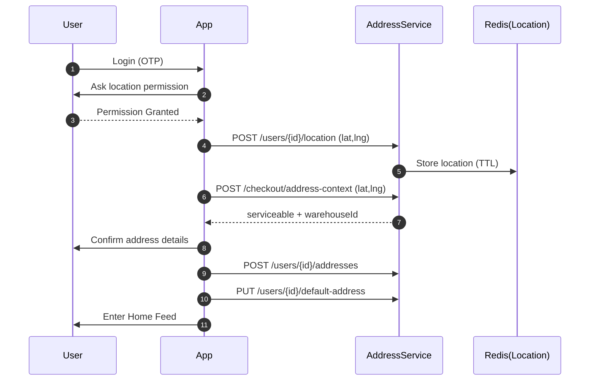
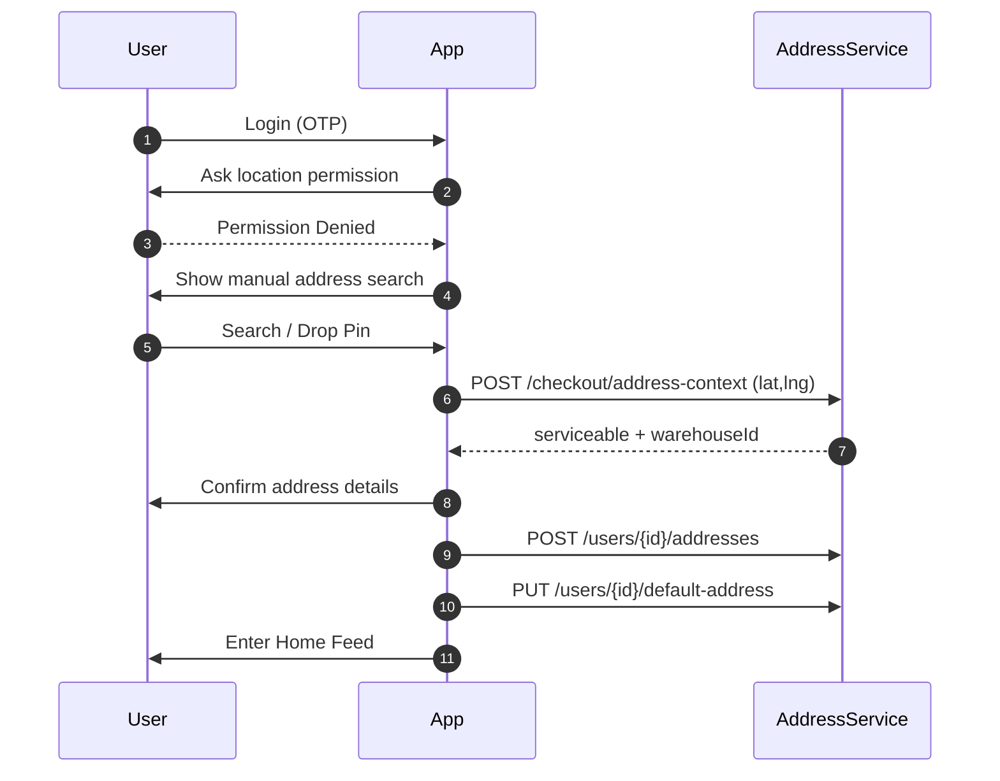
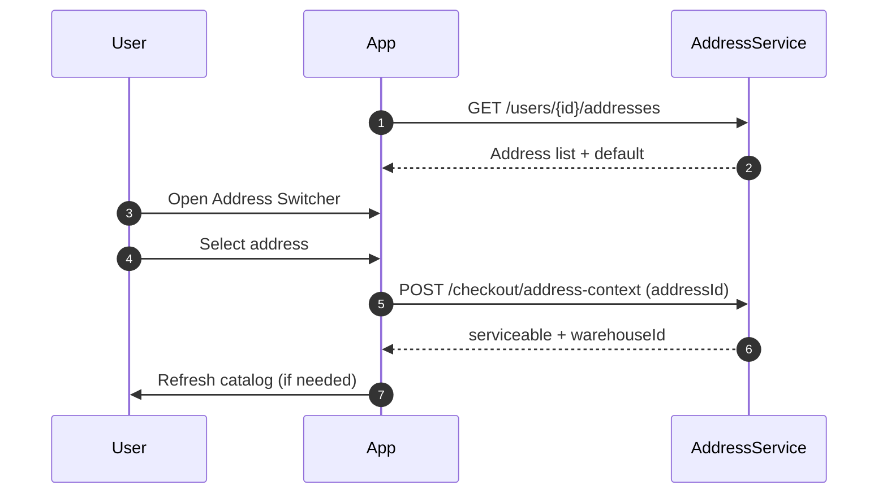
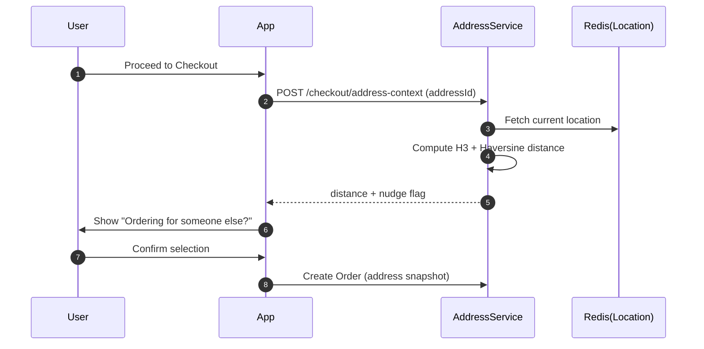
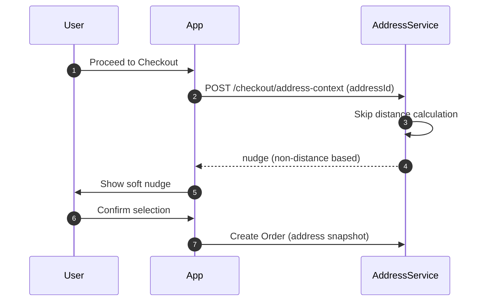
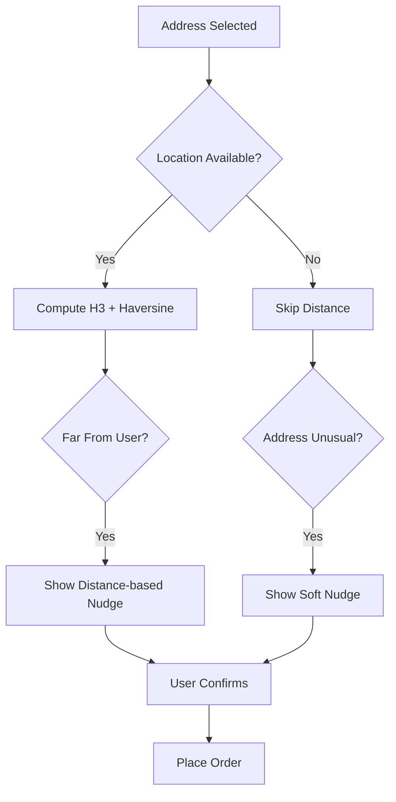

# Grabbit Address & Location – Diagrams

*(User flows + backend interaction diagrams for address selection, location permission, and checkout)*

---

## Diagram 1: New User – Location Permission GRANTED

---

## Diagram 2: New User – Location Permission DENIED

---

## Diagram 3: Existing User – Address Switcher

---

## Diagram 4: Checkout – Ordering for Someone Else (Location Available)

---

## Diagram 5: Checkout – No Location Permission

---

## Diagram 6: Backend Decision Flow (Simplified)

---

## Key Design Principle

> **Location enhances experience. Manual address always works.**

---
