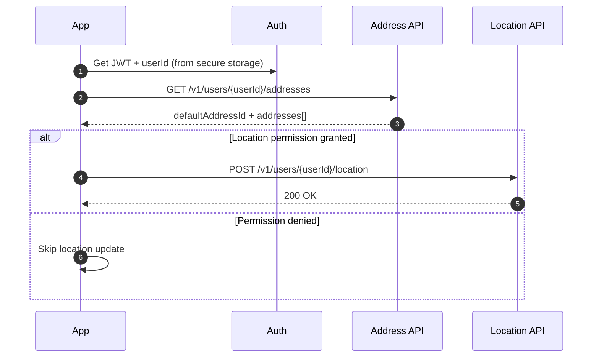
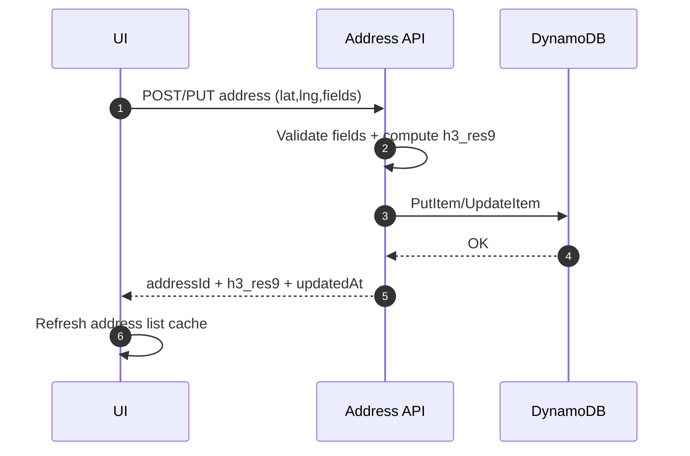
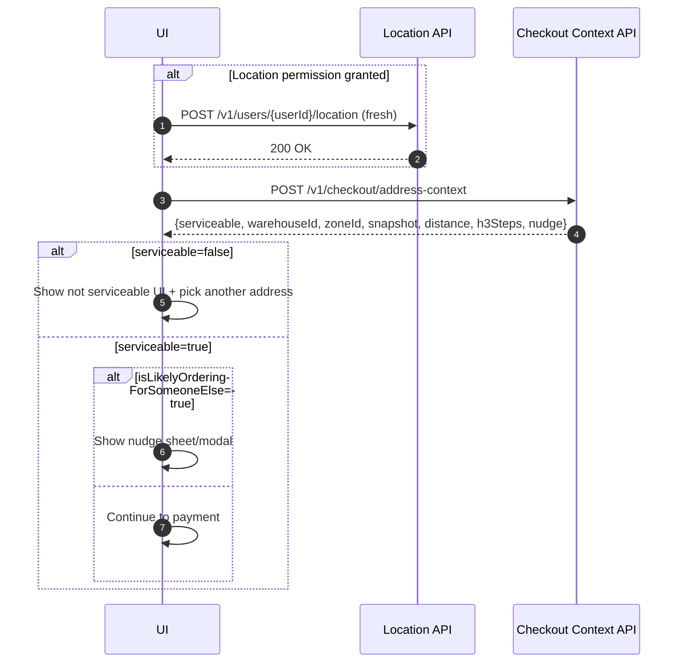
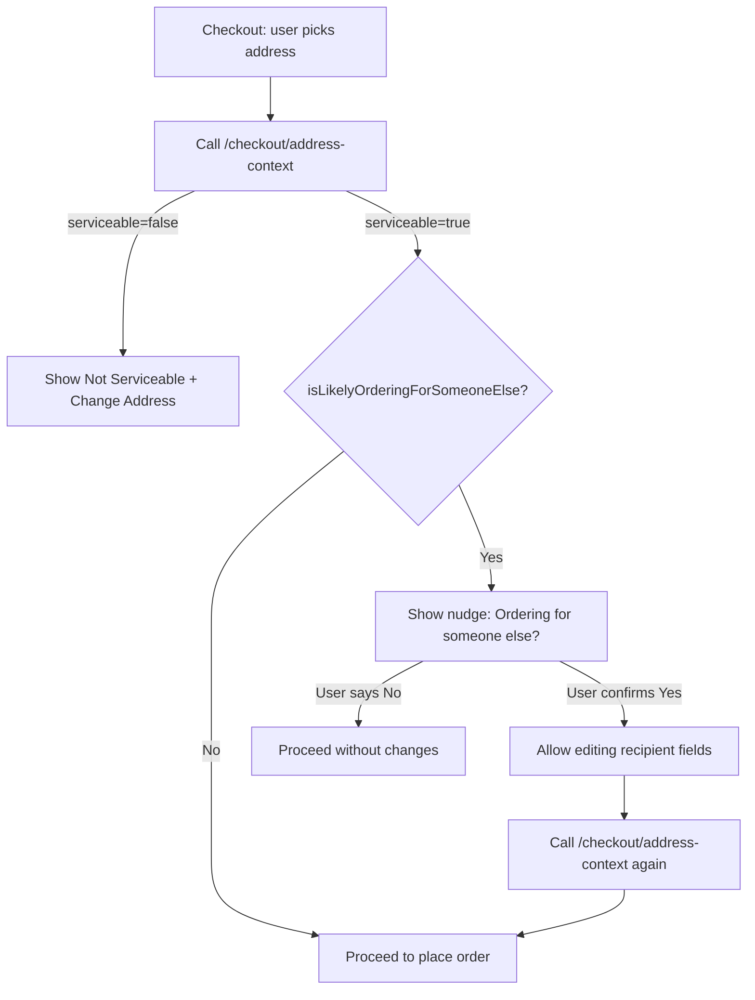

# Grabbit Mobile App Integration – Address & Location Platform

This doc explains how to integrate the **backend-owned address management + Redis current location + H3 distance + “ordering for someone else” nudge + recipient email** platform into the **Grabbit mobile app (React Native)**.

> Goal: the app becomes a **thin client**: it captures location/address inputs and relies on backend for **storage, defaults, serviceability mapping, distance signals, nudges, and checkout snapshots**.

---

## 1) What changes in the mobile app

### 1.1 Before vs After

**Before (typical):**

* App stores addresses locally (AsyncStorage / local DB)
* Checkout uses client-selected address and directly proceeds
* Location is optional and not consistently pushed

**After (this integration):**

* App **reads/writes addresses via backend APIs**
* App **periodically updates current location** to backend (when permission allows)
* Checkout always calls **`/v1/checkout/address-context`** to get:

  * `addressSnapshot` (immutable)
  * serviceability `warehouseId/zoneId`
  * `distanceFromYouKm` + `h3StepsFromYou` (if location known)
  * `isLikelyOrderingForSomeoneElse` + message/reasonCodes

---

## 2) Mobile screens & UX flows

### 2.1 Screens impacted

1. **Onboarding / Profile**

   * Capture: `name`, `email` (already planned)
   * Ask for location permission (optional but recommended)

2. **Address List (Manage Addresses)**

   * Shows saved addresses from backend
   * Allows: create / edit / delete / set default

3. **Add/Edit Address**

   * Address form + map pin
   * Recipient details (Name/Phone/Email) optional
   * Delivery instructions

4. **Checkout Address Selector**

   * Choose saved address or “Deliver to a pinned location”
   * Calls `/checkout/address-context` whenever selection changes

5. **Nudge Modal / Bottom Sheet**

   * “Ordering for someone else?” prompt when backend flags it

---

## 3) Permissions & location strategy

### 3.1 Permission states

* **Granted:** app sends periodic location updates to backend
* **Denied:** app does not call `/location`; checkout still works (nudge becomes “soft”)
* **Blocked (don’t ask again):** show a settings CTA only when needed (e.g., to improve delivery accuracy)

### 3.2 When to send location

Recommended approach:

* **Foreground:** send on app open and then every 30–60 seconds while user is active on home/checkout.
* **Checkout:** send once right before calling `/checkout/address-context`.
* **Never spam:** backend also rate-limits, but app should throttle.

Payload: `lat/lng/accuracy/timestamp/source`.

---

## 4) API integration map

### 4.1 Auth requirement

All calls should include:

* `Authorization: Bearer <JWT>`
* `X-App-Version`, `X-Platform` (optional but useful)

UserId rule:

* Path/body `userId` must match JWT subject; otherwise backend returns 403.

### 4.2 Endpoints used by the app

**Address CRUD**

* `POST /v1/users/{userId}/addresses`
* `GET /v1/users/{userId}/addresses`
* `PUT /v1/users/{userId}/addresses/{addressId}`
* `DELETE /v1/users/{userId}/addresses/{addressId}`

**Default address**

* `PUT /v1/users/{userId}/default-address`

**Current location**

* `POST /v1/users/{userId}/location`

**Checkout context (key)**

* `POST /v1/checkout/address-context`

---

## 5) Recommended client architecture (React Native)

### 5.1 Modules

Create a dedicated folder:

```
src/
  api/
    http.ts
    addressApi.ts
    locationApi.ts
    checkoutApi.ts
  store/
    addressStore.ts
    checkoutContextStore.ts
  hooks/
    useLocationReporter.ts
    useAddressContext.ts
  screens/
    AddressListScreen.tsx
    AddressFormScreen.tsx
    CheckoutAddressScreen.tsx
  components/
    AddressCard.tsx
    AddressNudgeSheet.tsx
```

### 5.2 Key client states

* **AddressStore**

  * `addresses[]`, `defaultAddressId`, `loading`, `lastSyncAt`

* **CheckoutContextStore**

  * `selectedAddressId | pinnedLocation`
  * `contextResponse` (serviceable + snapshot + nudge info)
  * `loading`, `error`

* **LocationReporter**

  * `permissionState`, `lastSentAt`, `lastKnownLocation`

---

## 6) Integration flows with diagrams

### 6.1 App launch → sync addresses + location



### 6.2 Address create/edit → recompute H3 on server



### 6.3 Checkout selection → Address Context (serviceability + nudge)



### 6.4 Nudge decision UX flow



---

## 7) UI behavior details (what to render)

### 7.1 Address list UI

Each address card should show:

* `label` + `type` (HOME/WORK/OTHER)
* `line1` + landmark
* Recipient summary (if provided): name/phone/email
* Badge: **Default** if `addressId == defaultAddressId`

Actions:

* Tap → select for checkout
* 3-dot menu → Edit / Delete / Set Default

### 7.2 Checkout address section

Show:

* Selected address label + short lines
* If `distanceFromYouKm` present: show “X km away from you”
* If `serviceable=false`: show inline error + CTA to change address

### 7.3 Nudge sheet

Use backend message directly:

* `message`: “This address is 8.4 km away … Ordering for someone else?”

Two buttons:

* **Yes, for someone else** → open recipient edit mini-form (name/phone/email)
* **No, it’s me** → close and continue

> After user edits recipient fields, call `/checkout/address-context` again with recipient overrides.

---

## 8) Offline, caching, and resilience

### 8.1 Caching

* Cache address list in memory + disk (AsyncStorage) for fast startup.
* Always refresh from backend on app open, but display cached first.

### 8.2 Offline behavior

If offline:

* Allow browsing cached addresses
* Block checkout with a clear message (because context + serviceability is required)

### 8.3 Retry strategy

* Use exponential backoff for transient failures.
* If `/location` fails, do not block the user.
* If `/checkout/address-context` fails, block checkout and show retry CTA.

---

## 9) Event tracking (minimum)

Track these events (client-side):

* `address_list_loaded`
* `address_created`, `address_updated`, `address_deleted`
* `default_address_set`
* `location_permission_state`
* `location_update_sent` (count only, don’t log lat/lng)
* `checkout_context_called`
* `checkout_not_serviceable_shown`
* `nudge_shown`, `nudge_yes`, `nudge_no`

> Do not log full address lines, phone, or email in analytics.

---

## 10) Integration checklist (do this in 1 week)

### Day 1–2: Plumbing

* Add API client module + auth interceptor
* Implement `GET /addresses` and cache
* Build Address Store

### Day 3–4: Address screens

* Address list screen + default badge + actions
* Address form screen (create/edit)
* Wire to POST/PUT/DELETE + optimistic UI

### Day 5: Location reporter

* Permission flow + throttled `/location` updates
* Hook into app foreground + checkout

### Day 6–7: Checkout context + nudge

* Implement `/checkout/address-context` integration
* Serviceability UI + nudge sheet
* Ensure order creation stores `addressSnapshot` received from backend

---

## 11) Notes for backend contract alignment

* App should treat **`addressSnapshot` as canonical** for the order.
* App should not try to compute H3 or distance; backend is source of truth.
* `recipientEmail` should be lowercased in UI but server also validates.

---

## Appendix A: Optional (nice-to-have) enhancements

1. **“Last delivered here”** banner using `lastUsedAt`
2. **Smart address ordering**: default first, then most used
3. **“Add recipient quickly”**: use `user_profile.defaultRecipient*` as suggestions
4. **Serviceability preview** on address list (fetch lazily)
