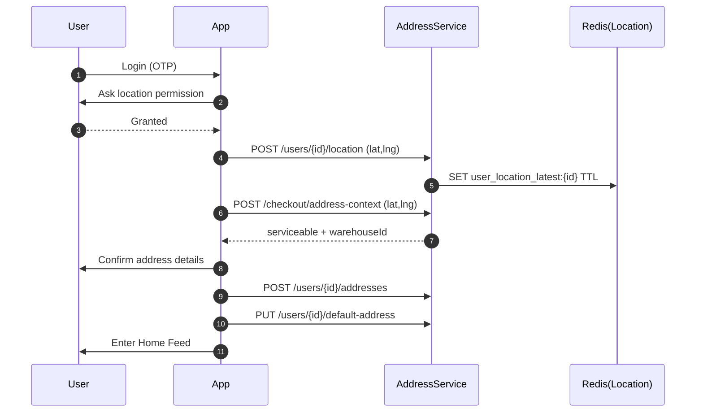
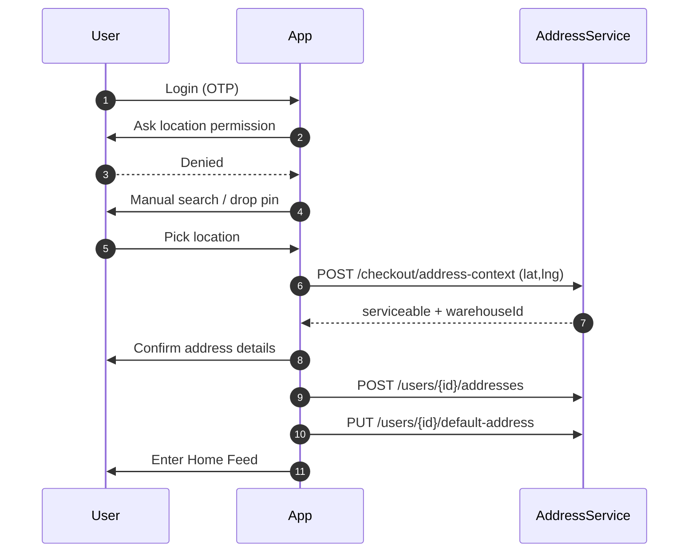
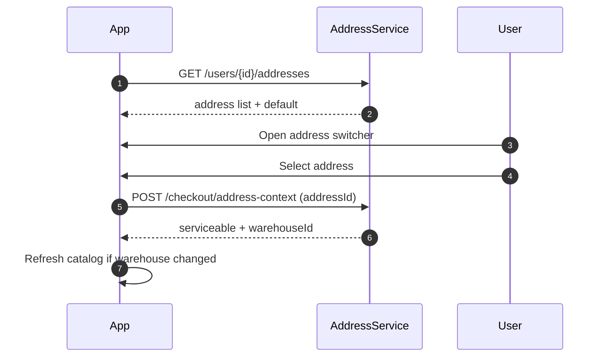
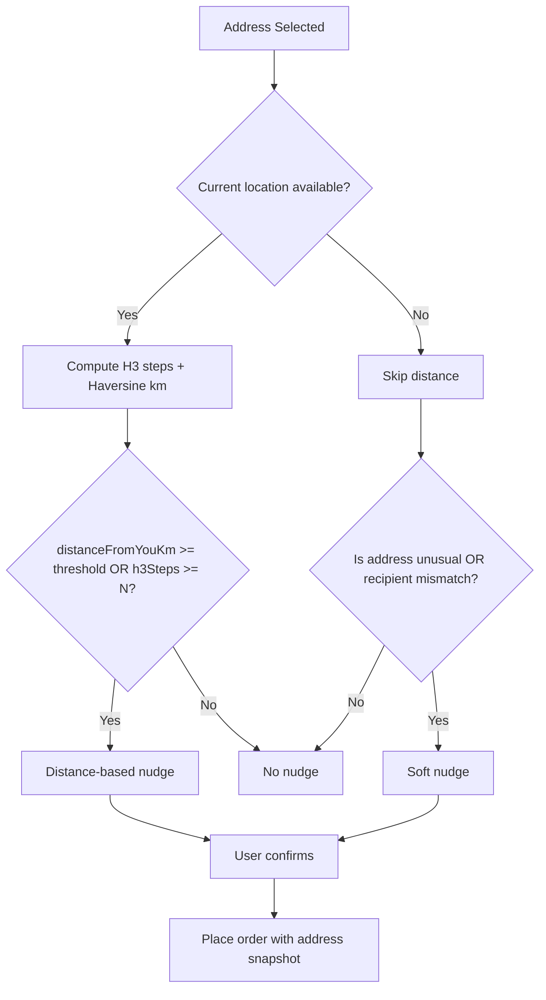

# Grabbit – Address & Location Platform HLD (Backend-Owned)

**Scope:** Move address management + current location + “ordering for someone else” detection to backend.

**Primary design goals:**

* Users can **save & select multiple addresses**
* App works **fully without location permission**
* Backend can show **distance (km)** when likely ordering for someone else
* Backend returns **serviceability + warehouse mapping** for every selection
* Orders store an **immutable address snapshot**

---

## 1) Functional Requirements

### 1.1 Address Management

* Create / update / delete (soft) multiple addresses per user
* Mark one address as **Default**
* Allow user to **select any address** per session/order without changing default
* Store recipient details per address (name, phone optional)

### 1.2 Current Location (Optional)

* Store user’s **latest location** (lat/lng/accuracy/time) when permission is granted
* Use it to:

  * improve delivery ETA and warehouse mapping (optional)
  * compute **distance-from-you** for nudges

### 1.3 “Ordering for Someone Else” Nudge

* Detect when selected delivery address likely indicates ordering for someone else
* When location exists, show **distanceFromYouKm** and use H3 to compute grid steps
* When location doesn’t exist, show a **soft nudge** without distance

### 1.4 Serviceability + Warehouse Mapping

* For any selected address (saved or pinned):

  * return `serviceable: true/false`
  * return `warehouseId`, `zoneId` (or reason if not serviceable)

### 1.5 Order Snapshot

* On order placement, store an **address snapshot** (immutable) including:

  * address text + lat/lng + recipient + instructions
  * flags (`orderingForSomeoneElse`, optional distance metadata)

---

## 2) Non-Functional Requirements

* **Latency:**

  * Address list: p95 < 150ms
  * Address-context evaluation: p95 < 250ms
* **Reliability:** location is best-effort; ordering must work without it
* **Security/Privacy:** strict user-level authorization, avoid logging raw address/phone
* **Scalability:** designed for growth (many addresses/users, frequent reads)

---

## 3) High-Level Architecture

### 3.1 Components

1. **AddressService** (primary)

   * Address CRUD + default address
   * Address validation / normalization
   * Checkout context API (distance + nudge)

2. **LocationStore (Redis)** (ephemeral)

   * Stores latest user location with TTL

3. **Geo/Serviceability Module** (internal adapter)

   * Maps lat/lng → zoneId/warehouseId
   * Validates if address is serviceable

4. **OrderService**

   * Accepts validated address snapshot
   * Persists snapshot immutably with order

---

## 4) Data Storage Design (Cost-Effective)

### 4.1 DynamoDB – Source of Truth

#### Table: `user_profile`

* **PK:** `userId`
* Fields:

  * `defaultAddressId`
  * `defaultRecipientName` (optional)
  * `defaultRecipientPhone` (optional)
  * `createdAt`, `updatedAt`

#### Table: `user_address`

* **PK:** `userId`
* **SK:** `addressId`
* Fields:

  * `type` (HOME/WORK/OTHER)
  * `label` ("Home", "Mom", "Office")
  * `recipientName`, `recipientPhone` (optional)
  * `line1`, `line2`, `landmark`, `pincode`, `city`, `state`
  * `lat`, `lng`
  * `h3_res9` (string)
  * `deliveryInstructions` (optional)
  * `isDeleted` (soft delete)
  * `useCount`, `lastUsedAt`
  * `createdAt`, `updatedAt`


### 4.2 Redis – Ephemeral Current Location

#### Key: `user_location_latest:{userId}` (TTL)

Value:

* `lat`, `lng`, `accuracyMeters`, `timestamp`, `h3_res9`
  TTL:
* 14 days (suggested)

---

## 5) API Design

### 5.1 Address CRUD

* `POST   /v1/users/{userId}/addresses`
* `GET    /v1/users/{userId}/addresses`
* `GET    /v1/users/{userId}/addresses/{addressId}`
* `PUT    /v1/users/{userId}/addresses/{addressId}`
* `DELETE /v1/users/{userId}/addresses/{addressId}`  *(soft delete)*

### 5.2 Default Address

* `PUT /v1/users/{userId}/default-address`

  * body: `{ "addressId": "..." }`

### 5.3 Current Location

* `POST /v1/users/{userId}/location`

  * body: `{ lat, lng, accuracyMeters, timestamp, source }`
  * server computes `h3_res9` and stores in Redis

### 5.4 Checkout Context (Key API)

* `POST /v1/checkout/address-context`

Request options:

* Saved address: `{ "addressId": "..." }`
* Pinned location: `{ "lat": 12.97, "lng": 77.62, "pinnedText": "..." }`

Optional overrides:

* `{ "recipientName": "...", "recipientPhone": "..." }`

Response (example):

```json
{
  "serviceable": true,
  "warehouseId": "dhanbad-1",
  "zoneId": "bankmore",
  "addressSnapshot": {
    "line1": "...",
    "landmark": "...",
    "pincode": "...",
    "city": "Dhanbad",
    "lat": 23.79,
    "lng": 86.43,
    "recipientName": "Subham",
    "recipientPhone": null
  },
  "distanceFromYouKm": 8.4,
  "h3StepsFromYou": 24,
  "isLikelyOrderingForSomeoneElse": true,
  "reasonCodes": ["FAR_FROM_YOU", "NEW_ADDRESS"],
  "message": "This address is 8.4 km away from where you are. Ordering for someone else?"
}
```

---

## 6) Core Flows

### 6.1 New User – Location Permission Granted



### 6.2 New User – Location Permission Denied



### 6.3 Existing User – Select Any Address



---

## 7) H3 + Distance Computation

### 7.1 What is stored

* For every address and location update, compute:

  * `h3_res9 = latLngToCell(lat, lng, 9)`

### 7.2 What is computed at checkout

* If current location exists in Redis:

  * `distanceFromYouKm = haversine(currentLatLng, deliveryLatLng)` *(for display)*
  * `h3StepsFromYou = gridDistance(h3_current, h3_delivery)` *(for fast scoring)*

### 7.3 Nudge decision logic



Suggested defaults (tune per city):

* `thresholdKm = 2.5`
* `N = 10` *(at H3 resolution 9)*

---

## 8) “Ordering for Someone Else” Heuristic (v1)

Score-based approach:

* +0.5 if recipientName/recipientPhone differs from user defaults
* +0.2 if address `useCount == 0` (new address)
* +0.2 if `distanceFromYouKm` above threshold (if available)
* +0.1 if address label hints (mom/dad/office) *(optional)*

If score ≥ 0.6 → show nudge.

When location is missing:

* do not compute distance
* rely on: new address + recipient mismatch + usage patterns

---

## 9) Order Snapshot Contract

On order creation, store:

* `addressSnapshot` (full fields)
* `addressId` (optional reference)
* `orderingForSomeoneElse` (boolean)
* `recipientName/phone` (if override)
* optional: `distanceFromYouKm` metadata

This prevents old orders from changing if user edits address later.

---

## 10) Security, Privacy, Observability

### 10.1 Security & Privacy

* Authorize by `userId` in JWT vs path param
* Avoid logging raw address & phone
* Mask sensitive fields in errors

### 10.2 Observability

Track:

* address-context latency, failure reasons
* serviceability failures by zone/pincode
* nudge shown rate vs accepted rate

---

## 11) Rollout Plan (Low Risk)

1. Launch AddressService with CRUD + default
2. Switch app reads to backend (addresses + default)
3. Add checkout address-context API
4. Integrate nudge + snapshot into OrderService
5. Add Redis current location (best-effort)
6. Remove local address storage

---

## 12) Open Decisions (Optional, Phase 2)

* Maintain “usual location clusters” based on delivered orders to reduce false nudges for travelers
* Add reverse-geocoding text normalization for better UI
* Add admin tooling for support to view addresses safely
