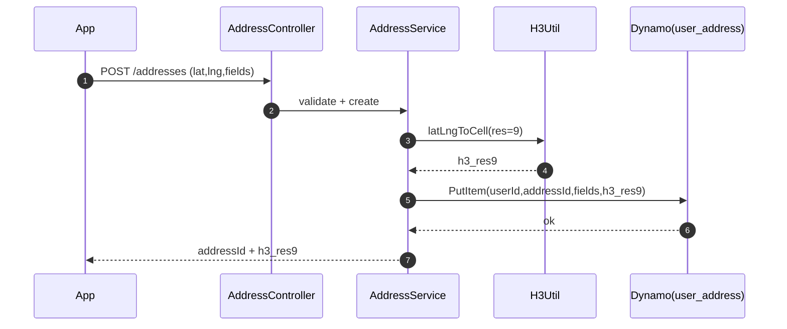
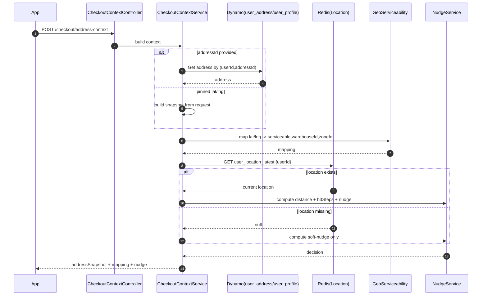

# Grabbit – Address & Location Platform (LLD)

This LLD implements the HLD for **backend-owned address management + Redis current location + H3 distance + “ordering for someone else” nudge**, with **recipient email** support.

> Assumption: Service is implemented as **Spring Boot (Kotlin/Java)**. If you are using Node, the same structure applies.

---

## 0) Key Decisions

* **Source of truth:** DynamoDB (`user_profile`, `user_address`)
* **Ephemeral store:** Redis for latest location (`user_location_latest:{userId}` with TTL)
* **Geo indexing:** H3 resolution `9` stored as `h3_res9`
* **Distance shown to user:** Haversine distance in km (display)
* **Fast distance signal:** H3 grid distance in steps (scoring)
* **Order correctness:** Orders store **immutable addressSnapshot**

---

## 1) Service Modules & Package Layout

```
com.getgrabbit.address
 ├── api
 │   ├── AddressController
 │   ├── LocationController
 │   └── CheckoutContextController
 ├── service
 │   ├── AddressService
 │   ├── DefaultAddressService
 │   ├── LocationService
 │   ├── CheckoutContextService
 │   ├── NudgeService
 │   ├── GeoServiceabilityService
 │   └── ValidationService
 ├── repo
 │   ├── UserProfileRepository (Dynamo)
 │   ├── UserAddressRepository (Dynamo)
 │   └── LocationRepository (Redis)
 ├── model
 │   ├── UserProfile
 │   ├── UserAddress
 │   ├── AddressSnapshot
 │   ├── UserLocation
 │   └── NudgeDecision
 ├── dto
 │   ├── request/*
 │   └── response/*
 ├── util
 │   ├── H3Util
 │   ├── GeoUtil (Haversine)
 │   └── MaskingUtil
 └── security
     ├── JwtAuthFilter
     └── AuthorizationValidator
```

---

## 2) Data Model (DynamoDB + Redis)

### 2.1 DynamoDB: `user_profile`

**PK:** `userId`

Fields:

* `userId: String`
* `defaultAddressId: String?`
* `defaultRecipientName: String?`
* `defaultRecipientPhone: String?`
* `defaultRecipientEmail: String?`
* `createdAt: Long`
* `updatedAt: Long`

### 2.2 DynamoDB: `user_address`

**PK:** `userId`
**SK:** `addressId`

Fields:

* `userId: String`
* `addressId: String`
* `type: enum {HOME, WORK, OTHER}`
* `label: String` (e.g., “Home”, “Mom”, “Office”)
* `recipientName: String?`
* `recipientPhone: String?`
* `recipientEmail: String?`
* `line1: String`
* `line2: String?`
* `landmark: String?`
* `pincode: String?`
* `city: String?`
* `state: String?`
* `lat: Double`
* `lng: Double`
* `h3_res9: String`
* `deliveryInstructions: String?`
* `isDeleted: Boolean`
* `useCount: Long`
* `lastUsedAt: Long?`
* `createdAt: Long`
* `updatedAt: Long`

**Access patterns**

* List addresses: Query `PK=userId`, filter `isDeleted=false`
* Get by id: GetItem `(userId, addressId)`
* Update: UpdateItem with condition `attribute_exists(PK)`
* Soft delete: UpdateItem set `isDeleted=true`

### 2.3 Redis: Latest location

**Key:** `user_location_latest:{userId}`
**TTL:** 14 days

Value JSON:

* `lat: Double`
* `lng: Double`
* `accuracyMeters: Double?`
* `timestamp: Long`
* `source: enum {GPS, NETWORK, MANUAL}`
* `h3_res9: String`

---

## 3) API Contract (LLD-level)

### 3.1 Address CRUD

#### POST `/v1/users/{userId}/addresses`

Request:

```json
{
  "type": "HOME",
  "label": "Home",
  "recipientName": "Subham",
  "recipientPhone": null,
  "recipientEmail": null,
  "line1": "Flat 12, Silver County",
  "line2": null,
  "landmark": "Near ...",
  "pincode": "826001",
  "city": "Dhanbad",
  "state": "Jharkhand",
  "lat": 23.795,
  "lng": 86.430,
  "deliveryInstructions": "Call at gate"
}
```

Response:

```json
{
  "addressId": "addr_...",
  "h3_res9": "...",
  "createdAt": 0,
  "updatedAt": 0
}
```

Validation:

* `line1` required, 3–200 chars
* `lat/lng` required and within valid range
* email: if present, lowercase + basic regex

#### GET `/v1/users/{userId}/addresses`

Response:

```json
{
  "defaultAddressId": "addr_...",
  "addresses": [
    {
      "addressId": "addr_...",
      "type": "HOME",
      "label": "Home",
      "recipientName": "Subham",
      "recipientPhone": null,
      "recipientEmail": null,
      "line1": "...",
      "lat": 23.79,
      "lng": 86.43,
      "h3_res9": "...",
      "useCount": 12,
      "lastUsedAt": 0
    }
  ]
}
```

#### PUT `/v1/users/{userId}/addresses/{addressId}`

* Partial update allowed
* Recompute `h3_res9` if lat/lng changes

#### DELETE `/v1/users/{userId}/addresses/{addressId}`

* Soft delete `isDeleted=true`
* If deleted address is default: set `defaultAddressId=null` (or next most used)

### 3.2 Default Address

#### PUT `/v1/users/{userId}/default-address`

Request:

```json
{ "addressId": "addr_..." }
```

Rules:

* address must exist and not deleted
* single update in `user_profile`

### 3.3 Current Location

#### POST `/v1/users/{userId}/location`

Request:

```json
{
  "lat": 12.97,
  "lng": 77.62,
  "accuracyMeters": 18,
  "timestamp": 1738480000000,
  "source": "GPS"
}
```

Server behavior:

* compute `h3_res9`
* store in Redis with TTL
* if location permission not granted, app simply never calls this

### 3.4 Checkout Context (Key API)

#### POST `/v1/checkout/address-context`

Request (saved address):

```json
{
  "userId": "u_...",
  "addressId": "addr_...",
  "recipientName": null,
  "recipientPhone": null,
  "recipientEmail": null
}
```

Request (pinned):

```json
{
  "userId": "u_...",
  "lat": 12.97,
  "lng": 77.62,
  "pinnedText": "Koramangala",
  "recipientName": null,
  "recipientPhone": null,
  "recipientEmail": null
}
```

Response:

```json
{
  "serviceable": true,
  "warehouseId": "dhanbad-1",
  "zoneId": "bankmore",
  "addressSnapshot": {
    "label": "Home",
    "type": "HOME",
    "line1": "...",
    "line2": null,
    "landmark": "...",
    "pincode": "826001",
    "city": "Dhanbad",
    "state": "Jharkhand",
    "lat": 23.79,
    "lng": 86.43,
    "h3_res9": "...",
    "recipientName": "Subham",
    "recipientPhone": null,
    "recipientEmail": null,
    "deliveryInstructions": "Call at gate"
  },
  "distanceFromYouKm": 8.4,
  "h3StepsFromYou": 24,
  "isLikelyOrderingForSomeoneElse": true,
  "reasonCodes": ["FAR_FROM_YOU", "NEW_ADDRESS"],
  "message": "This address is 8.4 km away from where you are. Ordering for someone else?"
}
```

---

## 4) Flow Diagrams (LLD)

### 4.1 Address Save Flow (includes H3 compute)



### 4.2 Checkout Context Flow (location optional)



---

## 5) Core Algorithms

### 5.1 H3 Computation

* Resolution: `9`
* Stored in:

  * each address record (`h3_res9`)
  * Redis location value (`h3_res9`)

### 5.2 Haversine Distance (km) – Display

Inputs: `(lat1,lng1)`, `(lat2,lng2)`

* Output rounded to 1 decimal
* If computed distance < 0.2 km, can display `"<0.2"`

### 5.3 H3 Grid Distance – Scoring

* `h3Steps = gridDistance(h3_current, h3_delivery)`
* Used in nudge threshold check

### 5.4 Nudge Scoring (v1)

Constants (tunable per city):

* `DIST_KM_THRESHOLD = 2.5`
* `H3_STEP_THRESHOLD = 10` (res9)
* `NUDGE_SCORE_THRESHOLD = 0.6`

Score calculation:

* `+0.5` recipient mismatch vs defaults (name/phone/email)
* `+0.2` new address (`useCount==0`) or never used
* `+0.2` far-from-you (if distance available and above threshold OR h3Steps above threshold)
* `+0.1` label hint (optional)

Decision:

* if score >= 0.6 => `isLikelyOrderingForSomeoneElse=true`
* message selection:

  * if `distanceFromYouKm != null`: distance-based message
  * else: soft message

Reason codes:

* `FAR_FROM_YOU`
* `RECIPIENT_MISMATCH`
* `NEW_ADDRESS`
* `UNUSUAL_ADDRESS`

---

## 6) Validation Rules (Detailed)

### 6.1 Address Fields

* `line1`: required, 3–200 chars
* `label`: 1–30 chars
* `type`: enum
* `pincode`: if present, 6 digits
* `lat`: -90..90
* `lng`: -180..180

### 6.2 Recipient Fields

* `recipientName`: if present, 2–60 chars
* `recipientPhone`: if present, normalize E.164 (India default +91) or store raw + country
* `recipientEmail`: if present, lowercase + basic validation

### 6.3 Security

* `userId` in path/body must match JWT subject
* Reject cross-user access with 403

---

## 7) Repositories (LLD)

### 7.1 UserAddressRepository (Dynamo)

Methods:

* `putAddress(userId, address)`
* `getAddress(userId, addressId)`
* `listAddresses(userId)`
* `updateAddress(userId, addressId, patch)`
* `softDeleteAddress(userId, addressId)`

Implementation notes:

* Use conditional updates to avoid overwriting unexpected state
* Increment `useCount` and set `lastUsedAt` when address is used in an order (can be done asynchronously)

### 7.2 UserProfileRepository (Dynamo)

Methods:

* `getProfile(userId)`
* `setDefaultAddress(userId, addressId)`
* `setDefaultRecipient(userId, name?, phone?, email?)`

### 7.3 LocationRepository (Redis)

Methods:

* `setLatestLocation(userId, location, ttlDays=14)`
* `getLatestLocation(userId)`

---

## 8) Error Handling

Standard error response:

```json
{
  "errorCode": "ADDRESS_NOT_FOUND",
  "message": "Address does not exist",
  "details": {}
}
```

Error codes:

* `ADDRESS_NOT_FOUND`
* `ADDRESS_DELETED`
* `DEFAULT_ADDRESS_INVALID`
* `NOT_SERVICEABLE`
* `VALIDATION_ERROR`
* `FORBIDDEN`
* `RATE_LIMITED`

---

## 9) Rate Limiting & Abuse Controls

* `POST /location`: limit to e.g. **1 req / 10 seconds** per user (app-side + server-side)
* `POST /checkout/address-context`: limit to e.g. **10 req / minute** per user

---

## 10) Observability (LLD)

Metrics:

* `address.list.latency_ms`
* `address.create.latency_ms`
* `checkout.context.latency_ms`
* `checkout.context.location.miss_rate`
* `nudge.shown_rate`, `nudge.accept_rate`
* `serviceability.fail_rate` by city/zone

Logging:

* Never log full address lines or email/phone
* Log only `addressId`, `zoneId`, coarse geo (optional: h3 prefix)

---

## 11) Backward Compatibility & Migration

* Phase 1: backend read APIs live; app still keeps local cache
* Phase 2: switch app reads to backend
* Phase 3: switch checkout to `address-context`
* Phase 4: remove local address storage

---

## 12) Test Plan (Minimum)

### Unit tests

* H3 compute (lat/lng -> cell)
* Haversine distance correctness
* Nudge scoring for:

  * far distance
  * recipient mismatch
  * new address
  * no location

### Integration tests

* Dynamo put/get/list/update/soft delete
* Redis set/get with TTL
* Address-context end-to-end

### Edge tests

* default address deleted
* serviceability false
* location missing

---

## Appendix: Soft Nudge Copy

* With distance: `"This address is {X} km away from where you are. Ordering for someone else?"`
* Without distance: `"This delivery address looks different from your usual ones. Ordering for someone else?"`
